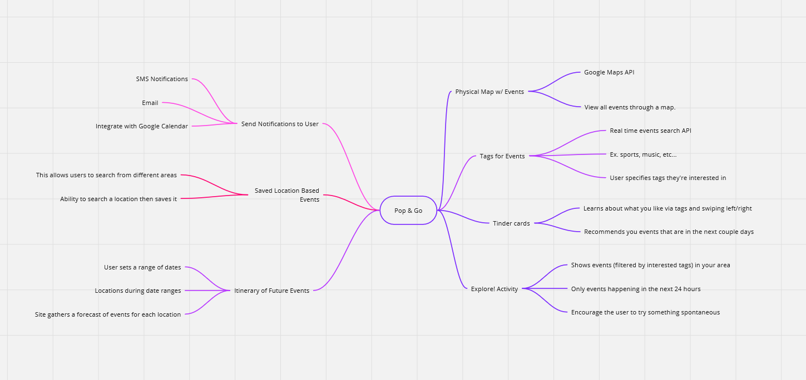
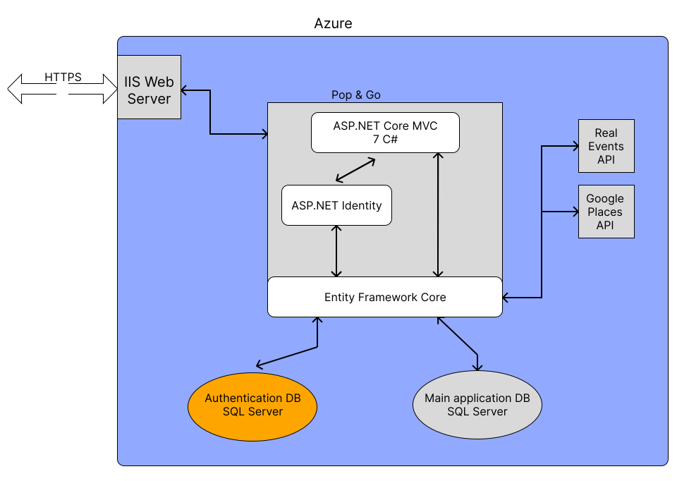
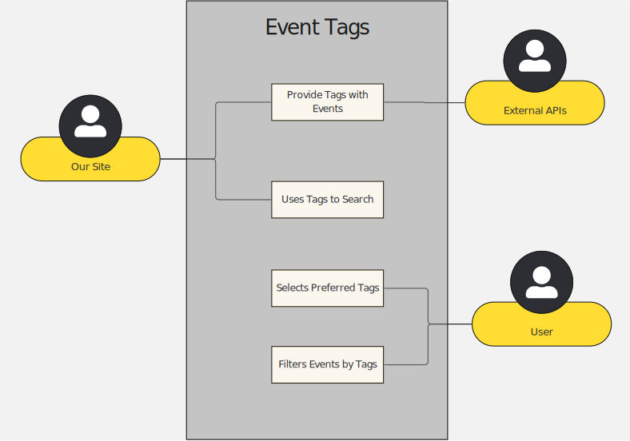
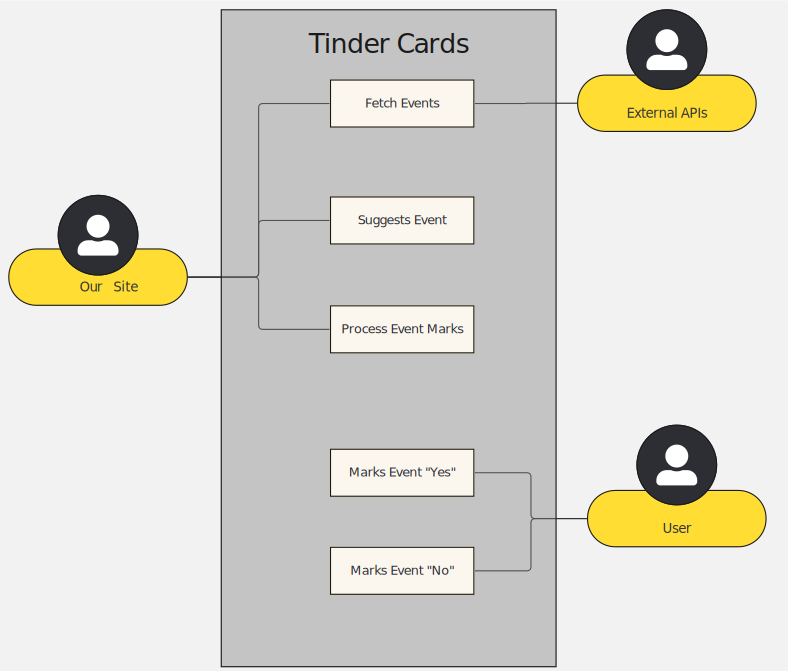

Pop & Go Inception Worksheet
=====================================

## Summary of Our Approach to Software Development

We are going to follow Agile and Scrum practices to the best of our ability to work together as a team towards a common goal: the creation of a clean, accessible, and professional website. Specifically, a website dedicated to connecting users and communities with current and future events.

## Initial Vision Discussion with Stakeholders

Pop & Go is an event discovery platform designed to seamlessly integrate with users' lives, delivering real-time event notifications through SMS, email, and Google Calendar. With its Tinder-Like Cards feature, users engage in an instant interactions, swiping left or right to shape preferences. Personalized through customizable tags like sports, food, entertainment, outdoor activties, and amongst other interest. 

Pop & Go offers a dynamic exploration experience. The Explore Page empowers users to navigate curated events within 24 hours, encouraging spontaneous engagement. The Itinerary feature adds convenience, allowing users to set date ranges, specify locations, and receive forecasts. Complemented by a Physical Map, Pop & Go envisions redefining event discovery by providing an immersive, personalized, and real-time journey. The proposal stems from a recognized need for a more engaging and immediate event discovery solution, setting Pop & Go apart from competitors like meetup.com and eventbrite.com by focusing on instant engagement, personalized exploration, and convenient itinerary planning. 

### List of Stakeholders and their Positions (if applicable)
Who are they? Why are they a stakeholder?

Developers & Tech Teams, Tourists, travellers, event organizers, as well as other users who are interested to go into a spontenous event based on their interest. 

Developers and Tech Team:

    The development team responsible for building and maintaining the application are key stakeholders, as the success of Pop & Go reflects their efforts.

Tourist : 

    They are a stake holder because traveling into a new place even with a plan that tourist can find out more events that they can do.

Travellers : 

    Before going to a new place travellers can use the application to find and create itinerary of events based their interest and put those plans/events into their calendar.

Event Organizers:

    Individuals or companies organizing events have a stake in Pop & Go's success, as it provides them with a platform to promote and reach a targeted audience.

Users Interest : 

    The stakeholders are broad in this area beause we could have an athlete looking events in sports or a specific sport such as soccer to attend a tournament/league. There could be someone who enjoys outdoors and would like to do those types of events. As well as users who are intersted in entertainment and this could be in movie, concerts, and other forms of entertainment events.

## Initial Requirements Elaboration and Elicitation

### Elicitation Questions
1. Are there any tags in the API or do we have to create our own?
2. Are there APIs that we can use to develop this project or are we creating our own?
3. Do we need to pay for the API? Is it free?
4. What can we do to make Tinder-Like Feature better?

## List of Needs and Features
1. User Accounts
    1. User Profile pages
    2. User Interests
    3. Itineraries
    4. Manage Locations
    5. Manage Interests Data
2. Random Events section
    1. Tinder-like cards
    2. Swiping left and right for interest gathering
    3. Algorithm for monitoring and tracking interest
3. Support for Google Places and Real-Time Events APIs
    1. Internal APIs
    2. Search Interface
    3. Filtered Results
4. Gather upcoming and current events from external APIs
    1. Events from Location
    2. Events during a time range
    3. Events within Categories
5. Present User with Categories to specify interested tags
6. Populate home page with user's Event Feed (if logged in)
    1. Events within a certain time period (user setting)
    2. Events displayed per category
    3. Access events from display
7. Explore! page to showcase random upcoming events
8. Itinerary planner for upcoming travels
9. Shopping Cart of events to build a Day Itinerary
10. Users need to enter phone number and email for notifications
11. Connect with a service for SMS and Email notifications
     

## Initial Modeling

### Use Case Diagrams
Event Tags

Tinder Cards

### Sequence Diagrams

### Other Modeling
Home Page

Location Preference

Selecting Interests

Explore! Activity

Tinder-like Cards

## Identify Non-Functional Requirements
    1. Needs to have access to Google and Real-Time Event APIs
    2. 
    3.

## Identify Functional Requirements (In User Story Format)

E: Epic  
U: User Story  
T: Tasks

1. [E] Tinder-like Cards
    1. [U] 
    2. [U] 
2. [E] Tags on Events
3. [E] Itinerary of Future Events
    1. [U] As a User, I want to create an itinerary with a name, description, and date and time range to hold events.
    2. [U] As a User, my itinerary should be easy to locate from any page I am on.
    3. [U] As a User, I should be able to add any event to a current itinerary.
    4. [U] As a User, I need to be able to add multiple locations with their own date and time ranges.
    5. [U] As a User, I want to receive notifications for Itinerary events.
    6. [U] As a User, I need to set notification preferences on the Itinerary itself.
4. [E] Save Locations and Events
    1. [U] As a User, I want to save a location to access it later.
    2. [U] As a User, I want to save events that interest me.
    3. [U] As a User, I need to see my saved locations and events on my profile.
    4. [U] As a User, I want to search for events in a saved location that isn't my current location.
    5. [U] As a User, I want to browse saved events that haven't expired yet.
5. [E] Send Notifications
6. [E] Show Events on Map
7. [E] Exploration Activity

## Initial Architecture Envisioning
Diagrams and drawings, lists of components

## Agile Data Modeling
Diagrams, SQL modeling (dbdiagram.io), UML diagrams

[DB Diagram](db_diagram.txt)

## Timeline and Release Plan
[Timeline](../../timeline.html)